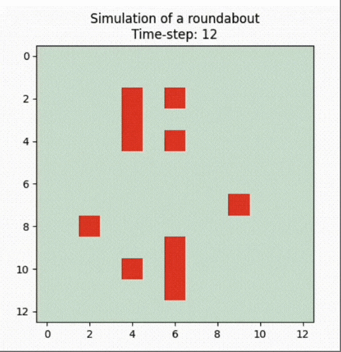

<a name="readme-top"></a>
<!-- PROJECT LOGO -->
<br />
<div align="center">
  <a target="_blank" href="https://github.com/Axel3246/Smart-TrafficAgent-TEC">
    
  </a>

<h3 align="center">Smart Traffic Agent for Distrito Tec Roundabout</h3>

  <p align="center">
    This project uses agent.py and Unity to model and simulate <br/>
    an agent capable of resolving ITESM's roundabout traffic problem.
    <br /><br />
    <a target="_blank" href="https://drive.google.com/drive/folders/14CkqHgOAIuTdzL1cLgOgP30bt8ABbcis?usp=sharing"><strong>Explore the docs »</strong></a>
    <br />
    <a target="_blank" href="https://drive.google.com/file/d/1x1VTxBMP88dZhI_Mhj-ZAJsGYBUmotuv/view?usp=share_link">View Live Demo</a>
  </p>
</div>


<!-- TABLE OF CONTENTS -->
<details>
  <summary>Table of Contents</summary>
  <ol>
    <li>
      <a href="#about-the-project">About The Project</a>
      <ul>
        <li><a href="#built-with">Built With</a></li>
      </ul>
    </li>
    <li>
      <a href="#getting-started">Getting Started</a>
      <ul>
        <li><a href="#prerequisites">Prerequisites</a></li>
        <li><a href="#installation">Installation</a></li>
      </ul>
    </li>
    <li><a href="#usage">Usage</a></li>
    <li><a href="#contributing">Contributors</a></li>
    <li><a href="#license">License</a></li>

  </ol>
</details>


<!-- ABOUT THE PROJECT -->
## About The Project

<div align="center">
  
  <p align="center">
    <i> Garza Sada and Av. del Estado Roundabout </i>
  </p>
</div>

Currently, one of the main problems in any city and metropolis is traffic. The exponential increase of habitants has allowed this to become more frequent and increasingly common on the streets, avenues, intersections, and crossroads of cities. Various infrastructure, such as bridges or roundabouts, has been installed with the aim of avoiding this, but they do not always have the necessary efficiency to solve the problem.

The roundabout located at Garza Sada and Av. del Estado is one of the busiest in Distrito Tec. It was remodeled back in 2017 due to the high incidence of car accidents recorded in 2015 (86). This allowed pedestrians and drivers to enjoy various improvements. There was synchronization between traffic lights, which theoretically would allow for better vehicle and pedestrian flow. However this feature cannot be seen during the busiest hours of the roundabout and its avenues allowing traffic accumulation, thus slowing the flow.

That leads us to the purpose of this project, which is to carry out a simulation with agent and computational graphics that allows to improve the vehicle flow in the Garza Sada and Av. del Estado roundabout. The simulation consists of two solutions described below:
<br></br>

* <strong>Roundabout Remodeling</strong>: It is expected that by removing or disabling some elements that make up the roundabout, such as, for example, a pair of traffic lights, the flow of traffic can greatly improve during highly traveled hours.

* <strong>Use of Smart Traffic Lights</strong>: Due to the new restructuring of the roundabout, it is expected that by introducing a new artificial intelligence system of smart traffic lights, it will be possible to maintain the privileges and benefits of pedestrians and drivers, as well as better traffic flow due to fast decision making depending on the amount of vehicles coming from Av. Garza Sada and Av. del Estado.

<p align="right">(<a href="#readme-top">Take me up!</a>)</p>

### Built With
The technologies that made possible this project are shown below.

* 
* 
* 
* 

<p align="right">(<a href="#readme-top">Take me up!</a>)</p>

<!-- GETTING STARTED -->
## Getting Started

To get a local copy up and running follow these simple example steps.

### Prerequisites

1. Be sure to have the lastest version of Python available in your computer. <a target="_blank" href="https://www.python.org/downloads/">Download Python </a> from the official website if you do not currently possess the lastest version.

2. Verify you have pip installed in your computer. You can check by running the following command in your terminal.

* Check pip version
  ```sh
  pip3 --version.
  ```
### Installation

1. Install Unity Hub and be sure to set it's version to <a target="_blank" href="https://unity.com/releases/editor/whats-new/2021.3.8">2021.3.8</a>.

2. Install any IDE of your choice. For this project we recommend <a target="_blank" href="https://code.visualstudio.com/"> Visual Studio Code</a>.

3. Clone the repo.
   ```sh
   git clone https://github.com/Axel3246/Smart-TrafficAgent-TEC
   ```

4. Once you clone the repo, open the `Simulation-DataServer` folder and go to `tc2008B_server.py` file. Change the port in the following line to any unused localhost port in your computer.
   ```py
   def run(server_class=HTTPServer, handler_class=Server, port=YOURPORT):
   ```

5. Unzip `Unity-TSTEC.zip` and move the folder to Unity Hub. Open it and go to <strong>Scripts > v3.1.2022 > </strong> `clon.cs`. Change the port in the following line to any unused port in your computer. <strong> This needs to match </strong> `tc2008B_server.py`<strong> port</strong>.
   ```cs
   string url = "http://localhost:YOURPORT";
   ```

<p align="right">(<a href="#readme-top">Take me up!</a>)</p>

<!-- USAGE EXAMPLES -->
## Usage

There is a three step process to use this project and see the simulation in Unity. Before these steps are declared, this agent is based on a grid enviroment which can be seen in the next picture.

<div align="center">
  
  <p align="center">
    <i> Delimited Grid Enviroment For The Agents </i>
  </p>
</div>

### Step One: Generating The JSON Objects

1. Open the `Simulation-DataServer` folder and go to `SPWN_v3.1.2022.ipynb` file. By default, the ipynb file will generate <strong> 10 agents</strong> with <strong>50 steps</strong>. If you want to change this, you may go to the <i> parameters </i>section and change the <i>steps</i> and <i>agents</i> values.

   ```py
   parameters = {
    # REMEMBER: steps are the "movements" an agent will make, which means more agents need more steps to finish the simulation.
    'size': 13,  # Height and length of the grid
    'steps': YOUR VALUE,
    'agents': YOUR VALUE,  # Percentage of grid covered by trees
    }
   ```
2. Once the parameters are set, click Run All. If done correctly, you should see at the bottom of the ipynb file an animation like the one stated below.

<div align="center">
  
  <p align="center">
    <i> Matplotlib's Agent Animation </i>
  </p>
</div>

3. Two archives will pop up in your folder: `data.json` and `dataSems.json`. These folders contain a JSON object with data generated from the ipynb simulation. The JSON will be deserialized in Unity to start the visualization of the data in the engine.

### Step Two: Starting The Python Server

1. Once you've done <strong> step one</strong>, go to `tc2008B_server.py` and click run. This step is taking in consideration that the user has already established their free localhost port in the file.

2. Now the server is running and it's actively listening for Unity's POST request.

### Step Three: Running The Simulation In Unity!

1. Now that we have the server running, the only thing left is to open Unity Hub and run the file `Reto Multiagentes v23-11-135`, which is inside the `Unity-TSTEC.zip` file. This step is taking in consideration that the user has already established their free localhost port in the `clon.cs` file.

2. If everything is in order, Unity will generate a POST request to `tc2008B_server.py` and will recieve the JSON object from the `data.json` and `dataSems.json` files in return, starting the simulation. It should look similar to this, depending on the parameters that had been previously set in <strong> step one</strong>.

<div align="center">
  
  <p align="center">
    <i> Unity Engine Simulation of the Smart Agents </i>
  </p>
</div>

### What If I Want A New Set Of Data?

Simple! Just repeat <strong>step one</strong> and you're good to go!
<p align="right">(<a href="#readme-top">Take me up!</a>)</p>

## That's a Wrap!

Congratulations! You have correctly setup a local copy of the project. Start experimenting! If you found this repository interesting, don't forget to star or fork it, it's highly appreciated :)!

_For more examples, images, and models please refer to the project's [Documentation](https://drive.google.com/drive/folders/14CkqHgOAIuTdzL1cLgOgP30bt8ABbcis?usp=sharing)_

<p align="right">(<a href="#readme-top">Take me up!</a>)</p>

<!-- CONTRIBUTING -->
## Contributors

Here you'll find the team that made possible this project. Feel free to check out their GitHub profiles too!

<a target="_blank" href="https://github.com/axel3246/Smart-TrafficAgent-TEC/graphs/contributors">
  
</a>

<p align="right">(<a href="#readme-top">Take me up!</a>)</p>

<!-- LICENSE -->
## License

Distributed under the MIT License. See `LICENSE.txt` for more information.

<p align="right">(<a href="#readme-top">Take me up!</a>)</p>
